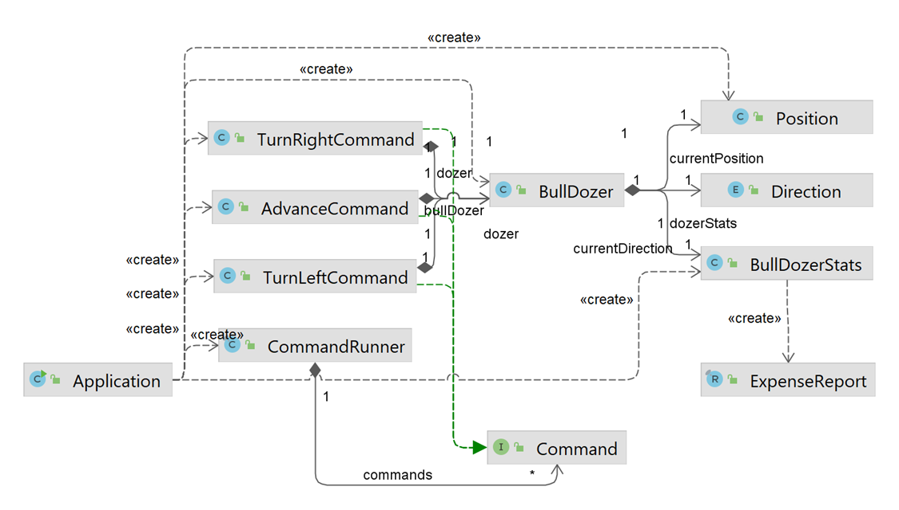

= Site Clearing Simulator

.Solution
- `CommandRunner` executes `Command` objects to call `left`, `right` and `advance` methods on _target object_, `BullDozer` (Command pattern)
- `Direction` of `BullDozer` changes by `left` and `right` method calls (State Pattern)
- `Position` of the `BullDozer` get updated by `advance` command
- `BullDozerStats` tracks activities in the `BullDozer`.
- `Application` creates `Command` (`TurnLeftCommand`, `TurnRightCommand`, `AdvanceCommand`, `QuitCommand`) based on _input from the user_ (keyboard). The commands are then executed by `CommandRunner`.

- When Simulation ends, `Application` calls `BullDozerStats` for `expense report` to be formatted  by `ReportFormatter` before printing the output with `ReportPrinter`.

.Execution Instructions:
- Prerequisites: `Java 17` and `Maven` shall be installed on the machine.
- Unzip the `simulator.zip`
- Open terminal/console and `cd simulator` directory unzipped in step 1.
- Compile using command: `mvn clean install`
- Run using command:
*  `java -jar target\simulator-1.0-SNAPSHOT.jar <filename.txt>`
* Example: `java -jar target\simulator-1.0-SNAPSHOT.jar c:\land_map.txt`

